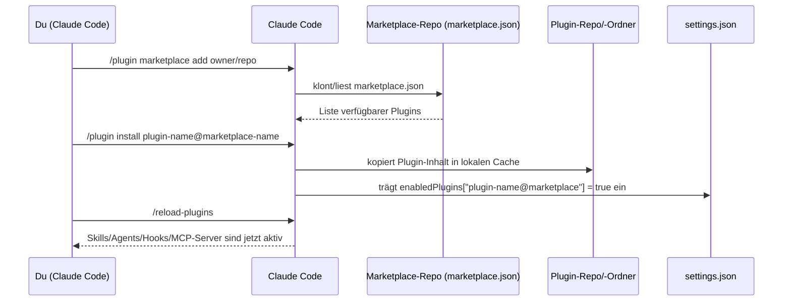

# Wie Claude Code Plugins funktionieren

Ergänzt die einzelnen Repo-Notizen in diesem Ordner um den generischen Mechanismus dahinter (verifiziert gegen code.claude.com/docs/en/plugins, Stand 01.08.2026).

## Aufbau eines Plugins

Ein Plugin ist einfach ein Ordner (meist ein Git-Repo) mit dieser Struktur:

```text
mein-plugin/
├── .claude-plugin/
│   └── plugin.json       # Manifest: name, description, version, author
├── skills/                # SKILL.md-Ordner (Fähigkeiten)
│   └── mein-skill/
│       └── SKILL.md
├── agents/                 # Subagent-Definitionen (.md mit Frontmatter)
├── hooks/
│   └── hooks.json          # Event-Handler (PostToolUse, Stop, ...)
├── .mcp.json                # MCP-Server-Konfiguration
├── .lsp.json                 # LSP-Server (Code-Intelligence)
└── settings.json              # Default-Settings, wenn Plugin aktiv ist
```

Wichtig: **Nur `plugin.json` liegt in `.claude-plugin/`** — alle anderen Ordner (`skills/`, `agents/`, `hooks/`, …) liegen auf Plugin-Root-Ebene daneben, nicht darin verschachtelt. Ein Plugin kann jede Kombination dieser Bausteine mitbringen — vom Ein-Skill-Plugin bis zum riesigen Bundle wie ECC (67 Agents + 281 Skills + Hooks + eigene MCP-Server).

## Der Marketplace-Mechanismus

Ein **Marketplace** ist selbst wieder nur ein Git-Repo, diesmal mit einer `.claude-plugin/marketplace.json`, die auflistet, welche Plugins es gibt und woher sie kommen:

```json
{
  "name": "my-plugins",
  "owner": { "name": "Your Name" },
  "plugins": [
    {
      "name": "quality-review-plugin",
      "source": "./plugins/quality-review-plugin",
      "description": "Adds a quality-review skill for quick code reviews"
    }
  ]
}
```

`source` kann ein lokaler Pfad, ein Git-Repo (`{"source": "github", "repo": "owner/repo"}`) oder eine URL sein — ein einzelnes Marketplace-Repo kann so beliebig viele Plugins bündeln (wie z.B. wshobson/agents mit 94 Plugins in einem Repo).

## Typischer Setup-Ablauf



Danach landet in `~/.claude/settings.json` (oder projektweit in `.claude/settings.json`) sinngemäß:

```json
{
  "extraKnownMarketplaces": {
    "meine-marketplace": {
      "source": { "source": "github", "repo": "owner/repo" }
    }
  },
  "enabledPlugins": {
    "plugin-name@meine-marketplace": true
  }
}
```

## Wichtige Details für die Praxis

- **Namespacing:** Skills eines Plugins heißen immer `/plugin-name:skill-name` (z.B. `/superpowers:brainstorm`), damit sich zwei Plugins mit gleichnamigen Skills nicht in die Quere kommen.
- **Lokal testen ohne Install:** `claude --plugin-dir ./mein-plugin` lädt ein Plugin direkt aus einem lokalen Ordner, ohne Marketplace/Install-Schritt — der Standardweg, um ein eigenes Plugin zu entwickeln, bevor man es teilt.
- **Caching:** Beim Install kopiert Claude Code den Plugin-Ordner in einen lokalen Cache. Ein Plugin kann deshalb nicht auf Dateien außerhalb seines eigenen Ordners verweisen (`../shared-utils` funktioniert nicht) — nur über Symlinks lösbar.
- **Standalone vs. Plugin:** Für rein persönliche/projektspezifische Anpassungen reicht ein einfaches `.claude/`-Verzeichnis (kurze Namen wie `/hello`, kein Marketplace nötig). Plugins lohnen sich, sobald geteilt/versioniert/wiederverwendet werden soll.
- **Offizielle Marketplaces:** `claude-plugins-official` (kuratiert von Anthropic, automatisch beim ersten Start registriert) und `claude-community` (Community-Submissions nach Review) sind bereits vorkonfiguriert bzw. mit einem Befehl hinzufügbar.

## Siehe auch
- [[../Glossar|Glossar]] für Begriffsdefinitionen
- [[../_Architektur-Überblick|Architektur-Überblick]] für das große Ganze
- [[__Übersicht]] für die konkret recherchierten Plugin-Repos
