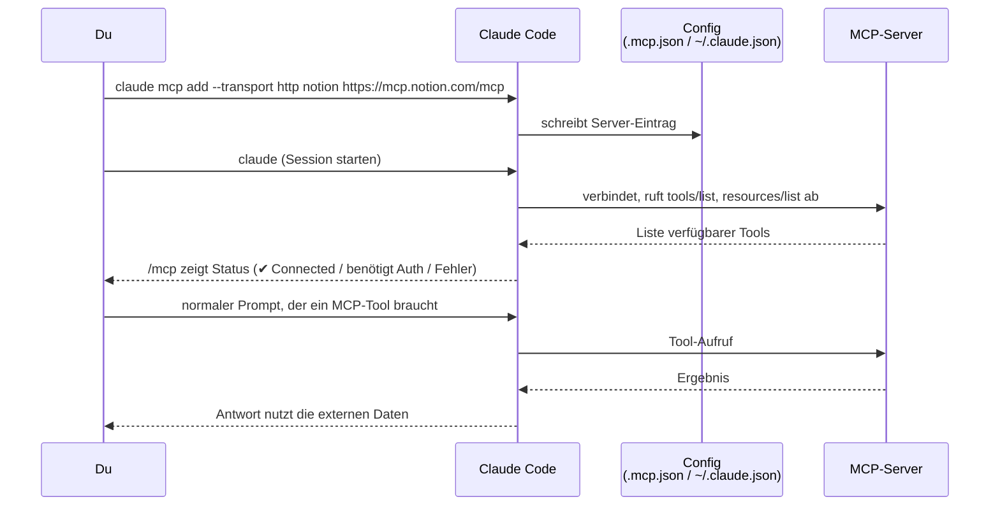

# Wie MCP (Model Context Protocol) funktioniert

Ergänzt die einzelnen Repo-Notizen um den generischen Mechanismus dahinter (verifiziert gegen code.claude.com/docs/en/mcp, Stand 01.08.2026).

## Grundprinzip: Client-Server-Architektur

Claude Code ist immer der **MCP-Client**. Ein **MCP-Server** stellt Tools, Resources und/oder Prompts bereit, die dann für Claude wie ganz normale Tool-Aufrufe aussehen — der eigentliche Zugriff auf das externe System (GitHub, Datenbank, Browser, Doku-API) passiert im Server.

```mermaid
flowchart LR
    Claude["Claude Code<br/>(MCP-Client)"] -- "stdio<br/>(lokaler Prozess)" --> Local["Lokaler MCP-Server<br/>z.B. Filesystem, Git"]
    Claude -- "HTTP / SSE / WebSocket<br/>(remote, mit Auth-Header)" --> Remote["Remote MCP-Server<br/>z.B. Context7, GitHub, Notion"]
    Local --> LocalSys["Lokales System<br/>(Dateien, Git-Repo)"]
    Remote --> RemoteSys["Externer Dienst / API<br/>(GitHub, Doku-DB, SaaS)"]
    Remote -.OAuth 2.0.-> Auth["Authentifizierung<br/>via /mcp Panel"]
```

## Die zwei Transport-Arten

| Transport | Läuft wo | Typischer Einsatz | Befehl |
|---|---|---|---|
| **stdio** | Lokaler Prozess (npx/uvx/docker) | Dateisystem, Git, lokale Skripte | `claude mcp add <name> -- npx -y paket` |
| **HTTP** (empfohlen für remote) | Remote-Server über URL | Cloud-Dienste (Context7, Notion, GitHub) | `claude mcp add --transport http <name> <url>` |
| SSE (deprecated) | Remote, ältere Server | nur wenn kein HTTP verfügbar | `claude mcp add --transport sse <name> <url>` |
| WebSocket | Remote, bidirektional | Server, die selbst Events pushen (z.B. Chat-Nachrichten) | `claude mcp add-json <name> '{"type":"ws",...}'` |

## Typischer Setup-Ablauf



Konfiguration landet je nach `--scope`-Flag in:
- **`local`** (Standard): nur für dich, im aktuellen Projekt
- **`project`**: `.mcp.json` im Projekt-Root, geteilt mit dem ganzen Team (Git-versioniert)
- **`user`**: `~/.claude.json`, projektübergreifend nur für dich

Bei geteilten Projekt-Servern (`.mcp.json`) muss jeder Nutzer sie einmal explizit bestätigen ("Pending approval"), bevor Claude Code sich verbindet — Schutzmechanismus gegen automatisches Ausführen von Fremdcode aus einem geklonten Repo.

## Wichtige Details für die Praxis

- **Verwaltung:** `claude mcp list` (Übersicht + Status), `claude mcp get <name>` (Details), `claude mcp remove <name>`, im laufenden Chat `/mcp`.
- **Automatischer Reconnect:** HTTP/SSE-Server reconnecten bei Verbindungsabbruch automatisch (bis zu 5 Versuche, exponentielles Backoff). Stdio-Server (lokale Prozesse) nicht — die laufen oder eben nicht.
- **Timeouts:** Standard-Tool-Timeout ist sehr großzügig (~28h), aber pro Server per `timeout`-Feld in `.mcp.json` konfigurierbar. Lange MCP-Aufrufe (>2 Min.) laufen automatisch im Hintergrund weiter, ohne die Session zu blockieren.
- **Output-Limit:** MCP-Tool-Ausgaben werden ab 25.000 Tokens standardmäßig gekappt (Warnung ab 10.000) — bei sehr "gesprächigen" Servern ggf. `MAX_MCP_OUTPUT_TOKENS` erhöhen.
- **Reservierte Namen:** `workspace`, `claude-in-chrome`, `computer-use` u.a. sind für eingebaute Server reserviert und können nicht überschrieben werden.
- **Plugins mit MCP:** Ein Plugin kann seine eigene `.mcp.json` mitbringen — dann läuft die Installation einfach über den normalen Plugin-Weg (siehe [[../Claude Code Plugins/_Funktionsweise|Plugins-Funktionsweise]]) statt über `claude mcp add`.

## Siehe auch
- [[../Glossar|Glossar]] für Begriffsdefinitionen
- [[../_Architektur-Überblick|Architektur-Überblick]] für das große Ganze
- [[__Übersicht]] für die konkret recherchierten MCP-Server-Repos
