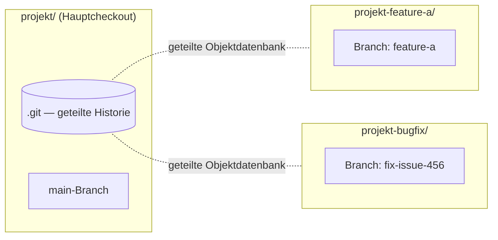
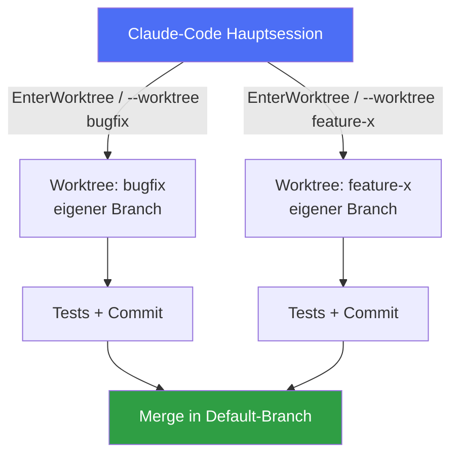

# Worktrees effizient nutzen

Recherchiert am 05.08.2026 aus der offiziellen Claude-Code-Doku (code.claude.com/docs/en/worktrees), der Git-Doku (git-scm.com/docs/git-worktree) und aktuellen Community-Guides zu parallelen Claude-Code-Sessions.

## Was ein Worktree ist

Ein **Git-Worktree** ist ein zusätzliches, eigenständiges Arbeitsverzeichnis mit eigenen Dateien und eigenem Branch — es teilt sich aber die komplette `.git`-Historie und Objektdatenbank mit dem Hauptverzeichnis. Das unterscheidet Worktrees von zwei gängigen Alternativen:

- **vs. `git checkout`/Stashen:** kein erzwungener Kontextwechsel mehr — statt Änderungen wegzustashen, um kurz einen anderen Branch anzuschauen, bleibt jeder Branch dauerhaft in seinem eigenen Verzeichnis ausgecheckt.
- **vs. mehrfachem Klonen:** kein Duplizieren der gesamten Repo-Historie — nur die tatsächlich bearbeiteten Dateien werden pro Worktree dupliziert, alles andere bleibt geteilt.

## Manuelles Setup mit reinem Git

```bash
# Worktree auf neuem Branch anlegen
git worktree add ../projekt-feature-a -b feature-a

# Worktree von einem existierenden Branch anlegen
git worktree add ../projekt-bugfix fix-issue-456

# Alle Worktrees auflisten
git worktree list

# Worktree wieder entfernen
git worktree remove ../projekt-feature-a
```

**Empfohlenes Layout:** Worktrees als **Sibling-Verzeichnisse** neben dem Hauptcheckout anlegen, nicht verschachtelt darin — vermeidet Probleme mit verschachtelten `.git`-Verzeichnissen und hält die Struktur vorhersehbar.

## Was pro Worktree isoliert ist vs. geteilt wird

| Isoliert (pro Worktree) | Geteilt (über alle Worktrees) |
|---|---|
| Arbeitsdateien | `.git`-Verzeichnis / Objektdatenbank |
| Checked-out Branch | Commit-Historie |
| `node_modules`, venv, Build-Artefakte | Remote-Konfiguration |
| `.env` & andere gitignorte Dateien | — |

Konsequenz: Ein Worktree ist ein **frischer Checkout** — Dependencies, `.env`-Dateien etc. müssen pro Worktree neu eingerichtet werden. Claude Code löst das für gitignorte Config-Dateien mit einer `.worktreeinclude`-Datei (Syntax wie `.gitignore`), die automatisch in jeden neuen Worktree kopiert wird.



## Claude-Code-native Worktree-Integration

Claude Code bringt eingebaute Worktree-Unterstützung mit, statt reines Git-Handling manuell zu orchestrieren:

- **`claude --worktree <name>`** (kurz `-w`) startet eine neue, isolierte Session unter `.claude/worktrees/<name>/` auf einem neuen Branch `worktree-<name>`. Ohne Namen wird einer generiert (z.B. `bright-running-fox`).
- **Innerhalb einer laufenden Session** kann man Claude einfach bitten, "in einem Worktree zu arbeiten" — Claude nutzt dafür selbst das `EnterWorktree`-Tool. Zum Verlassen dient `ExitWorktree` (mit `keep` oder `remove`).
- **`.claude/worktrees/` gehört ins `.gitignore`**, sonst tauchen Worktree-Inhalte als untracked Files im Hauptcheckout auf.
- **`worktree.baseRef`-Setting** steuert, wovon neue Worktrees branchen:
  - `"fresh"` (Default) — vom Remote-Default-Branch, sauberer Start
  - `"head"` — vom aktuellen lokalen HEAD, inkl. ungepushter Commits — sinnvoll, wenn ein Subagent auf laufender Arbeit aufsetzen soll
- **Von einer PR branchen:** `claude --worktree "#1234"` checkt `pull/1234/head` aus.



Der Kernnutzen: beide Aufgaben laufen **gleichzeitig in getrennten Verzeichnissen** — kein Kontextwechsel, keine Datei-Kollisionen, unabhängig testbar, unabhängig committbar.

## Subagenten automatisch isolieren

Auch Subagenten innerhalb einer Session können automatisch je in ihrem eigenen Worktree laufen, damit parallele Datei-Edits nicht kollidieren:

- Ad-hoc: Claude bitten, "Worktrees für deine Agenten zu nutzen"
- Dauerhaft für einen Custom-Subagent: `isolation: worktree` im Frontmatter (`.claude/agents/*.md`)

```yaml
---
name: refactorer
description: Führt mechanische Refactorings über viele Dateien durch
isolation: worktree
---
```

Subagent-Worktrees nutzen denselben Base-Branch wie `--worktree` (also `worktree.baseRef`) und werden automatisch entfernt, sobald der Subagent ohne Änderungen fertig ist. Mit Änderungen bleiben sie bis zum periodischen Cleanup-Sweep erhalten.

## Cleanup-Verhalten

| Situation | Verhalten |
|---|---|
| Unbenannte interaktive Session, Worktree sauber | Wird automatisch entfernt |
| Benannte Session, Worktree sauber | Claude fragt nach, ob behalten oder entfernen |
| Worktree hat offene Änderungen/Commits | Wird gefragt: `keep` (Verzeichnis + Branch bleiben) oder `remove` (beides wird gelöscht) |
| Headless-Run (`-p`) | Kein automatisches Cleanup — manuell mit `git worktree remove` aufräumen |
| Subagent-/Background-Worktrees | Periodischer Sweep entfernt sie nach `cleanupPeriodDays`, aber nie wenn noch offene Arbeit drin liegt |

## Praxis-Faustregeln

- **Ein Worktree pro paralleler, unabhängiger Aufgabe** — ein Bugfix und ein Feature sind zwei Worktrees, nicht ein Branch, zwischen dem man ständig hin- und herwechselt.
- **Nur bei echter Unabhängigkeit sinnvoll:** Parallele Worktrees funktionieren nur sauber, wenn die Aufgaben nicht dieselben Dateien anfassen — sonst lieber sequenziell oder mit Subagenten im selben Worktree arbeiten.
- **Vor dem Start einmalig Setup nachziehen** — jeder Worktree ist ein frischer Checkout, also Dependencies installieren, `.env` bereitstellen (oder `.worktreeinclude` einrichten).
- **Skalierungs-Erfahrungswert 2026:** 4–8 parallele Worktrees pro Entwickler sind gut handhabbar; darüber wird typischerweise die eigene Review-Kapazität zum Flaschenhals, nicht Claude selbst.
- **Aufräumen nicht aufschieben** — verwaiste Worktrees kosten Platz und verstopfen `git worktree list`; bei Headless-Runs (`-p`) selbst an `git worktree remove` denken.

## Konkrete Entscheidungshilfe

| Situation | Empfehlung |
|---|---|
| Bugfix und Feature gleichzeitig vorantreiben | Zwei separate Worktrees (`claude --worktree bugfix`, `claude --worktree feature-x`) |
| PR reviewen, ohne die eigene Arbeit zu unterbrechen | Eigener Worktree für den PR-Branch (`claude --worktree "#1234"`), danach entfernen |
| Mechanisches Refactoring über viele Dateien | Subagent mit `isolation: worktree` — läuft isoliert, räumt sich bei Erfolg selbst auf |
| Subagent soll auf ungepushter, laufender Arbeit aufsetzen | `worktree.baseRef: "head"` setzen |
| Aufgaben überschneiden sich bei denselben Dateien | Kein Worktree-Split — sequenziell oder im selben Worktree arbeiten |
