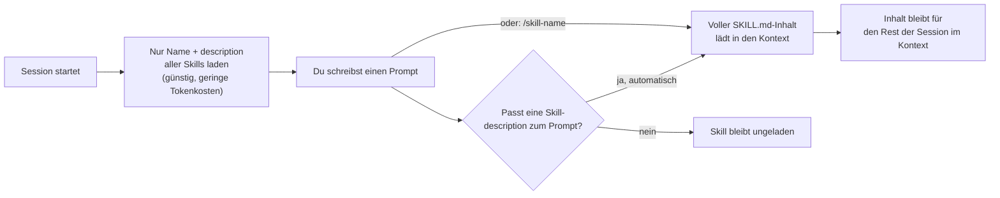

# Wie Claude Code Skills funktionieren

Ergänzt die einzelnen Repo-Notizen um den generischen Mechanismus dahinter (verifiziert gegen code.claude.com/docs/en/skills, Stand 01.08.2026).

## Aufbau einer Skill

Jede Skill ist ein Ordner mit einer `SKILL.md` als Pflicht-Datei, optional ergänzt um weitere Dateien:

```text
meine-skill/
├── SKILL.md           # Pflicht: Frontmatter + Anweisungen
├── reference.md        # optional: Detail-Doku, lädt nur bei Bedarf
├── examples.md          # optional: Beispiel-Outputs
└── scripts/
    └── helper.py          # optional: ausführbares Skript (wird nicht in Kontext geladen)
```

`SKILL.md` selbst besteht aus YAML-Frontmatter und Markdown-Anweisungen:

```yaml
---
name: my-skill                     # optional, Default = Ordnername
description: Was die Skill tut und wann sie genutzt werden soll
disable-model-invocation: true      # optional: nur manuell per /name aufrufbar
allowed-tools: Bash(git *)              # optional: Tools ohne Rückfrage erlaubt
---

Anweisungen, die Claude befolgt, wenn die Skill aktiv ist.
```

Nur `description` wird empfohlen — daran erkennt Claude, wann die Skill relevant ist.

## Wo Skills liegen (und wer sie sehen kann)

| Ort | Pfad | Gilt für |
|---|---|---|
| Enterprise | Managed Settings | Alle Nutzer der Organisation |
| Personal | `~/.claude/skills/<name>/SKILL.md` | Alle eigenen Projekte |
| Projekt | `.claude/skills/<name>/SKILL.md` | Nur dieses Projekt |
| Plugin | `<plugin>/skills/<name>/SKILL.md` | Wo das Plugin aktiv ist |

Bei Namenskonflikten gewinnt Enterprise > Personal > Projekt; Plugin-Skills sind immer namespaced (`plugin-name:skill-name`) und kollidieren deshalb nie mit den anderen Ebenen.

## Wie eine Skill geladen und ausgelöst wird ("Progressive Disclosure")



- **Automatische Auslösung:** Claude vergleicht deine Anfrage mit den geladenen `description`-Texten aller verfügbaren Skills und lädt bei Übereinstimmung den vollen Inhalt nach.
- **Manuelle Auslösung:** direkt per `/skill-name [argumente]`, z.B. `/deploy production`.
- **`disable-model-invocation: true`** sperrt die automatische Auslösung — sinnvoll für Skills mit Seiteneffekten (Deploy, Commit, Slack-Nachricht senden), die man nicht versehentlich von Claude selbst getriggert haben will.
- **`context: fork`** lässt die Skill statt inline im Hauptkontext in einem eigenen Subagenten laufen (siehe [[../Subagent & Workflow Collections/_Funktionsweise|Subagent-Funktionsweise]]) — nützlich für Recherche-lastige Skills, deren Rohdaten den Hauptkontext nicht verstopfen sollen.

## Typischer Setup-Ablauf (eigene/heruntergeladene Skill nutzen)

```bash
mkdir -p ~/.claude/skills/skill-name
# SKILL.md (+ optionale Zusatzdateien) hineinkopieren
# Claude Code erkennt neue Skills in bereits laufenden Sessions automatisch (Live Change Detection)
```

Bei Skills, die Teil eines Plugins sind, reicht stattdessen die normale Plugin-Installation (siehe [[../Claude Code Plugins/_Funktionsweise|Plugins-Funktionsweise]]) — die Skill wird dann automatisch mit installiert und ist unter `/plugin-name:skill-name` erreichbar.

## Wichtige Details für die Praxis

- **Kein Neustart nötig** für reine `SKILL.md`-Textänderungen unter `~/.claude/skills/` oder `.claude/skills/` — Claude Code beobachtet die Ordner live. Ein komplett neuer Skills-Ordner (der beim Sessionstart noch nicht existierte) braucht dagegen einen Neustart.
- **Verschachtelte Projekt-Skills:** `.claude/skills/` in Unterordnern eines Monorepos werden geladen, sobald Claude eine Datei in diesem Unterordner liest/editiert — praktisch für Package-spezifische Skills.
- **Kontext-Budget:** Skill-Beschreibungen werden gekürzt, wenn zu viele Skills gleichzeitig installiert sind (Budget ~1% des Kontextfensters) — ein Grund, nicht wahllos jede große Skill-Sammlung komplett zu installieren, sondern gezielt auszuwählen.
- **`skill-creator`-Plugin** (offizieller Marketplace) automatisiert das Testen/Verbessern eigener Skills (A/B-Vergleiche, Trigger-Genauigkeit messen).

## Siehe auch
- [[../Glossar|Glossar]] für Begriffsdefinitionen
- [[../_Architektur-Überblick|Architektur-Überblick]] für das große Ganze
- [[__Übersicht]] für die konkret recherchierten Skill-Library-Repos
