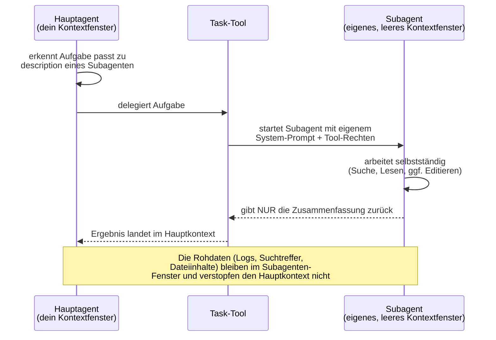
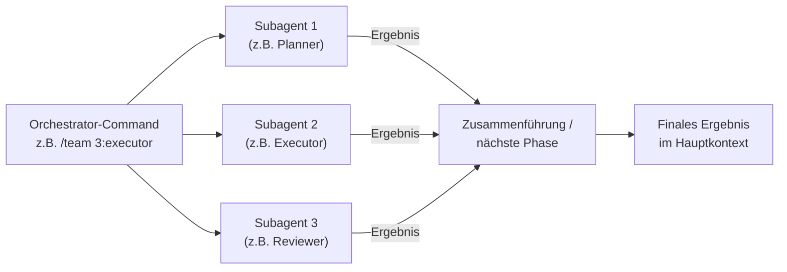

# Wie Claude Code Subagenten & Orchestrierung funktionieren

Ergänzt die einzelnen Repo-Notizen um den generischen Mechanismus dahinter (verifiziert gegen code.claude.com/docs/en/sub-agents, Stand 01.08.2026).

## Aufbau eines Subagenten

Ein Subagent ist eine einzelne Markdown-Datei mit YAML-Frontmatter:

```markdown
---
name: code-reviewer
description: Expert code reviewer. Use proactively after code changes.
tools: Read, Grep, Glob, Bash
model: sonnet
---

Du bist ein Senior-Code-Reviewer. Fokus auf Code-Qualität, Security, Best Practices.
```

- **`name`**: eindeutiger Bezeichner
- **`description`**: entscheidet, wann der Hauptagent automatisch an diesen Subagenten delegiert
- **`tools`**: welche Tools der Subagent nutzen darf (Rechte-Einschränkung, z.B. nur lesend)
- **`model`**: welches Modell läuft (z.B. günstiges Haiku für einfache Recherche statt Opus)

## Wo Subagenten liegen — und wer gewinnt bei Namenskonflikten

| Ort | Scope | Priorität |
|---|---|---|
| Managed Settings | Organisationsweit | 1 (höchste) |
| `--agents`-CLI-Flag | Nur aktuelle Session | 2 |
| `.claude/agents/` | Aktuelles Projekt | 3 |
| `~/.claude/agents/` | Alle eigenen Projekte | 4 |
| Plugin `agents/`-Ordner | Wo Plugin aktiv ist | 5 (niedrigste) |

Claude Code bringt außerdem eingebaute Subagenten mit: **Explore** (schnell, nur lesend, für Code-Recherche), **Plan** (Recherche im Plan-Modus), **general-purpose** (volle Tool-Palette für komplexe Multi-Step-Aufgaben).

## Wie eine Delegation abläuft (isoliertes Kontextfenster)



Das ist der Kernvorteil: eine aufwändige Recherche mit vielen Zwischenergebnissen bläht nicht die Haupt-Unterhaltung auf — nur das fertige Ergebnis kommt zurück.

## Wie Orchestrierung/Workflows darauf aufbauen

Die in diesem Ordner recherchierten Repos (oh-my-claudecode, myclaude, agent-review-panel, adamsreview) sind im Kern **Skills oder Commands, die mehrere Subagent-Aufrufe verketten**:



Je nach System läuft das **sequenziell** (Phase für Phase, z.B. oh-my-claudecode: plan→prd→exec→verify→fix), **parallel mit Konsolidierung** (z.B. adamsreview: bis zu 7 gleichzeitige Review-Linsen, dann Dedup) oder als echte **Debatte** (agent-review-panel: Reviewer sehen sich gegenseitig, widersprechen, ein Richter-Subagent entscheidet).

## Typischer Setup-Ablauf

```bash
# Eigenen/heruntergeladenen Subagenten manuell einbinden
mkdir -p ~/.claude/agents
# <name>.md mit Frontmatter hineinlegen
```

Für ganze Sammlungen (VoltAgent, wshobson/agents) läuft die Installation meist über den normalen Plugin-Mechanismus (siehe [[../Claude Code Plugins/_Funktionsweise|Plugins-Funktionsweise]]) — ein Plugin bringt einfach seinen eigenen `agents/`-Ordner mit.

## Wichtige Details für die Praxis

- **Kosten steuern:** `model: haiku` für einfache/häufige Subagent-Aufgaben spart deutlich gegenüber Opus/Sonnet.
- **Rechte einschränken:** `tools: Read, Grep, Glob` (kein Write/Edit/Bash) macht einen Subagenten de facto read-only — nützlich für reine Analyse-/Review-Rollen.
- **Sichtbarkeit prüfen:** installierte Subagenten erscheinen unter `/context` → Custom Agents; explizit ansprechbar per `@subagent-name`.
- **Kein automatischer Neustart-Bedarf** bei Textänderungen an bestehenden Agent-Dateien, aber ein komplett neuer `agents/`-Ordner braucht einen Neustart der Session.

## Siehe auch
- [[../Glossar|Glossar]] für Begriffsdefinitionen
- [[../_Architektur-Überblick|Architektur-Überblick]] für das große Ganze
- [[__Übersicht]] für die konkret recherchierten Subagent-/Workflow-Repos
