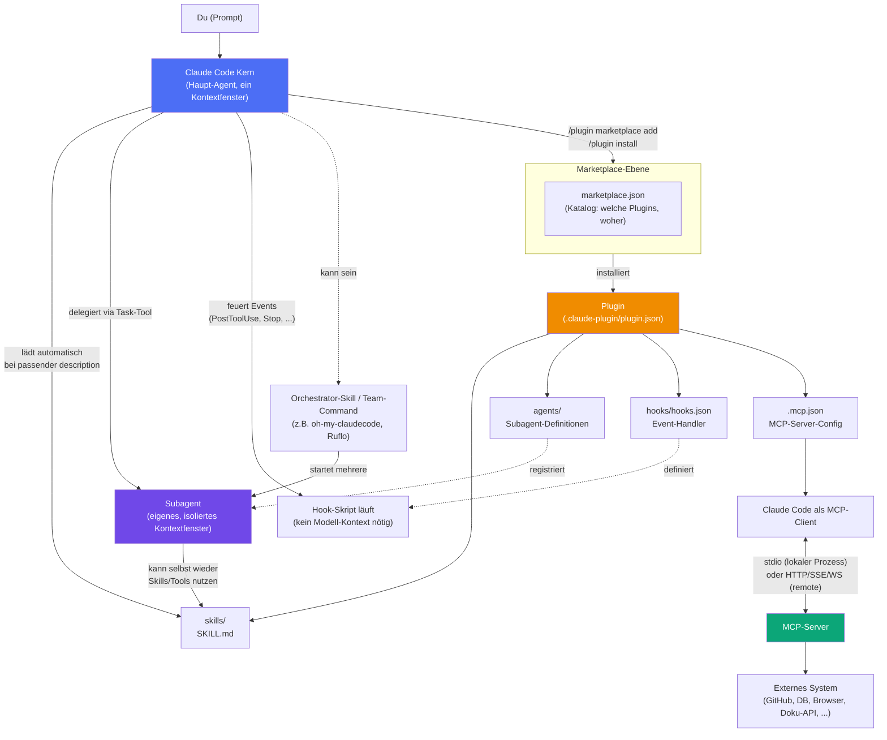

# Architektur-Überblick

Dieses Diagramm zeigt, wie die vier recherchierten Kategorien technisch zusammenhängen. Details zu jedem einzelnen Kasten stehen im [[Glossar]] und in der jeweiligen `Funktionsweise.md` pro Kategorie.

## Kurz erklärt

- **Ganz oben:** Du schreibst einen Prompt an den Claude-Code-Kern — das ist die eine "Haupt-Unterhaltung" mit ihrem eigenen Kontextfenster.
- **Plugins/Marketplace** sind der Distributionsweg: ein Marketplace-Repo listet in `marketplace.json`, welche Plugins es gibt; ein installiertes Plugin bringt eine beliebige Kombination aus Skills, Agents, Hooks und/oder einer MCP-Server-Config mit.
- **Skills** laufen meist *inline* im Hauptkontext (Anweisungstext wird eingefügt), können aber auch `context: fork` gesetzt bekommen und dann in einem eigenen Subagenten laufen.
- **Subagenten** sind der zentrale Mechanismus für Isolation: eigenes Kontextfenster, eigene Tool-Rechte, Ergebnis geht als Zusammenfassung zurück an den Hauptkontext. Orchestrator-Systeme (Ruflo, oh-my-claudecode, wshobson/agents) bauen genau darauf auf, indem sie mehrere Subagenten koordiniert nacheinander oder parallel starten.
- **Hooks** laufen komplett außerhalb des Modell-Kontexts — reine Skripte, die auf Ereignisse reagieren (z.B. nach jedem Datei-Edit automatisch linten).
- **MCP** ist der einzige Weg, mit *externen* Systemen zu sprechen: Claude Code ist immer der Client, der MCP-Server liefert die eigentliche Anbindung (lokal per stdio oder remote per HTTP/SSE/WebSocket).

Siehe auch die kategoriespezifischen Diagramme in:
- [[Claude Code Plugins/_Funktionsweise]]
- [[Skill Libraries/_Funktionsweise]]
- [[Subagent & Workflow Collections/_Funktionsweise]]
- [[MCP Server Collections/_Funktionsweise]]
